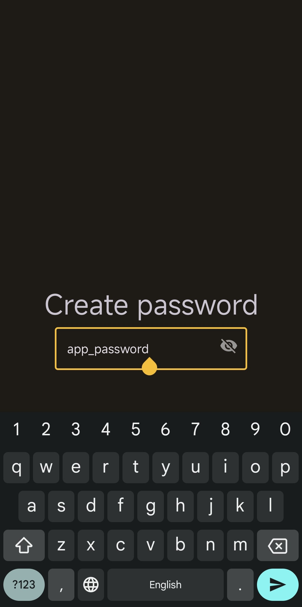
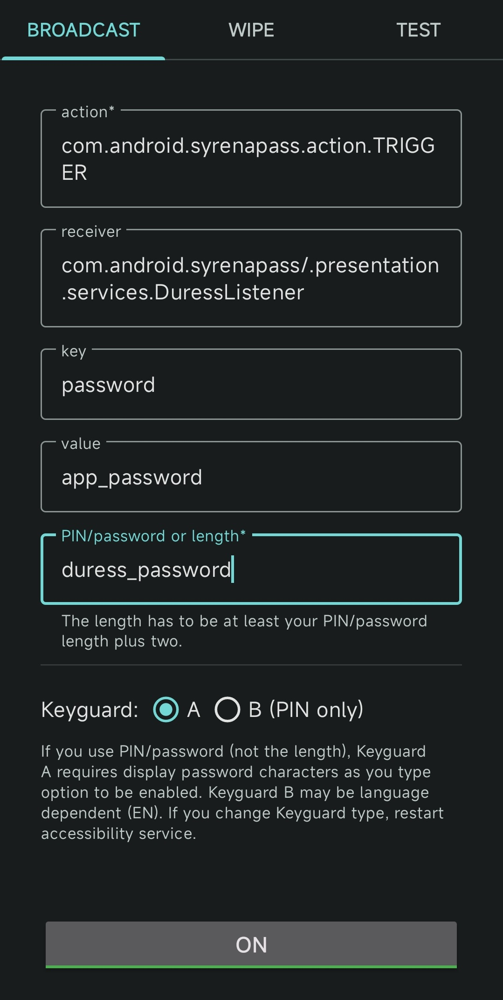

# SyrenaPass
[Readme на русском](./README_RU.md)

SyrenPass is an application that allows you to delete files when you enter a decoy password. It is similar to [Wasted](https://github.com/x13a/Wasted), but deletes only the data selected by the user, instead of completely clearing the device's memory, and if you have root rights, it will be able to delete itself. This makes the cleaning of files less noticeable to the adversary and creates less suspicion for him, and also allows you not to delete harmless but valuable information from the device.
**At the moment, it does not provide the necessary level of security and is under development.**
## How to use the app?
* Download application from github
* Create password for application and remember it. All apps data would be encrypted with this password

  
* Open menu "Files deletion settings"

  
* Add files and folders you want to delete.
* It is recommended that you first test the application on some not valuable data. For testing, you can enable logs in the appropriate section of the application.
* Open the application settings and allow files deletion

  
* Download app [Duress](https://github.com/x13a/Duress), open menu "BROADCAST" and set the following parameters.

  **action**: com.android.syrenapass.action.TRIGGER
  
  **receiver**: com.android.syrenapass/.presentation.services.DuressListener
  
  **key**: password
  
  **value**: your password for SyrenaPass
  
  **PIN/password or length**: A fake password to log in to the device (or its length), which will activate data deletion.

  
* If you then enter a fake password to log in to the device, then all the specified files will be deleted.
## What functionality will be added in the future?
* Duress will no longer be needed for the application to work, it will intercept passwords on its own. The fake password will have to match the SyrenaPass password.
* The ability to prohibit unauthorized copying of data from the device via USB will be added
* Features for root users will be added: deleting applications and deleting files that cannot be accessed without root rights.
* If you have root permissions, the application will be able to delete itself.
* The ability to delete files from cloud storage will be added
* Password security check will be added
* Test coverage will be improved and bugs fixed
* Translations into other languages will be added

## Known limitations

### Metadata
One of the disadvantages of deleting certain files or applications from the device instead of completely clearing the data is the inability to control the metadata about these files and applications scattered throughout the device. At a minimum, the applications in which you opened certain files may contain elements of these files in the cache or some other metadata confirming the existence of these files. Probably, deleting the applications that opened your secret files can help solve this problem.
### The first unlock of the device
The application does not work if you enter a false password when unlocking the device for the first time after restarting, because its data (like the data of other applications) is encrypted before the first password entry.
### Cloud backups
Some devices may save copies of your files in the cloud without your knowledge. They need to be deleted separately.
### Android vulnerabilities
The app can't do anything about Android vulnerabilities that allow you to recover deleted files or bypass the lock screen.
