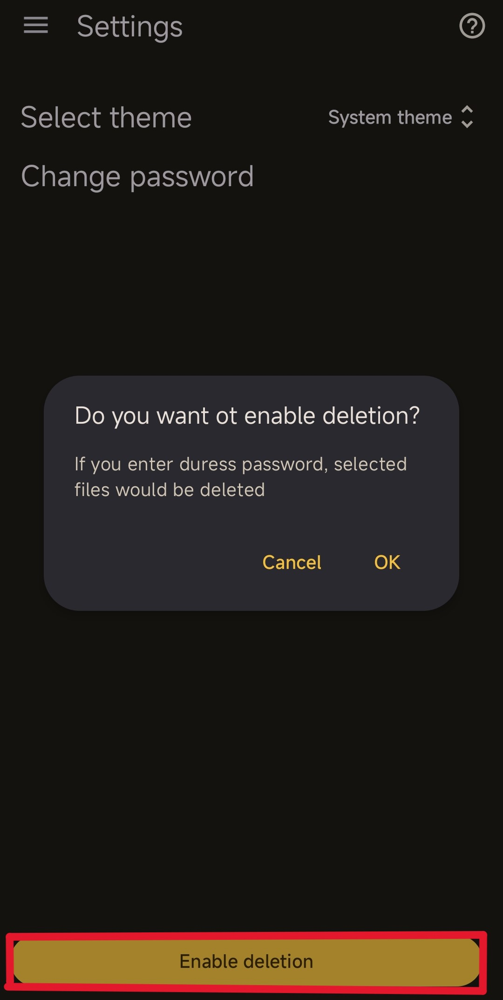

# SyrenaPass
SyrenPass - это приложение, позволяющее удалять файлы при вводе фейкового пароля блокировки. Оно похоже на [Wasted](https://github.com/x13a/Wasted), но удаляет только данные, выбранные пользователем, вместо полного очищения памяти устройства, а при наличии рут прав оно сможет и удалить само себя. Это делает очистку файлов менее заметной для противника и создаёт у него меньше подозрений, а также позволяет не удалять безобидную, но ценную информацию с устройства.
**На данный момент оно не обеспечивает нужного уровня безопасности и находится в разработке.**
## Как пользоваться приложением?
* Скачайте его с github
* Установите пароль для приложения и запомните его. Все Ваши данные в приложении будут зашифрованы этим паролем.

  
* Войдите в меню "Настройки файлов".

  
* Добавьте файлы и папки, которые вы хотите удалить.
* Рекомендуется сначала протестировать работу приложения на каких-то ненужных данных. Для тестирования вы можете включить логи в соответствующем разделе приложения.
* Откройте настройки приложения и разрешите удаление файлов

  
* Скачайте приложение [Duress](https://github.com/x13a/Duress), откройте раздел "BROADCAST" и вставьте следующие параметры.
  **action**: com.android.syrenapass.action.TRIGGER
  **receiver**: com.android.syrenapass/.presentation.services.DuressListener
  **key**: password
  **value**: Ваш пароль от SyrenaPass
  **PIN/password or length**: Фейковый пароль для входа в устройство (или его длина), который будет активировать удаление данных.

  
* Если вы после этого введёте фейковый пароль для входа в устройство, то все заданные файлы будут удалены.
## Какой функционал будет добавлен в будущем?
* Duress больше не будет нужен для работы приложения, оно будет перехватывать пароли самостоятельно. Фейковый пароль должен будет совпадать с паролем SyrenaPass.
* Будет добавлена возможность запретить несанкционированное копирование данных с устройства через USB
* Будут добавлены возможности для рут-пользователей: удаление приложений и удаление файлов, к которым нельзя получить доступ без рут прав.
* При наличии рут прав приложение получит возможность удалять само себя.
* Будет добавлена возможность удалять файлы из облачных хранилищ
* Будет добавлена проверка надёжности пароля
* Будет улучшен охват тестами и исправлены баги
* Будут добавлены переводы на другие языки

## Известные ограничения

### Метаданные
Один из недостатков удаления определённых файлов или приложений с устройства вместо полного очищения данных - это невозможность контролировать метаданные об этих файлах и приложениях, разбросанных по всему устройству. Как минимум приложения, в которых Вы открывали определённые файлы, могут содержать элементы этих файлов в кэше или какие-то иные метаданные, подтверждающие существование этих файлов. Удаление приложений, в которых открывались Ваши секретные файлы, может помочь решить эту проблему.
### Первая разблокировка устройства
Приложение не работает, если ввести ложный пароль при первой разблокировке устройства после перезагрузки, потому что его данные (как и данные остальных приложений) зашифрованы до первого ввода пароля.
### Облачные бэкапы
Некоторые устройства могут сохранять копии ваших файлов в облаке без Вашего ведома. Их нужно удалять отдельно.
### Уязвимости Android
Приложение ничего не может сделать с уязвимостями Android, позволяющими восстанавливать удалённые файлы или обходить экран блокировки.
